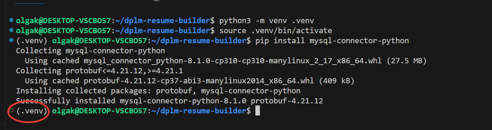
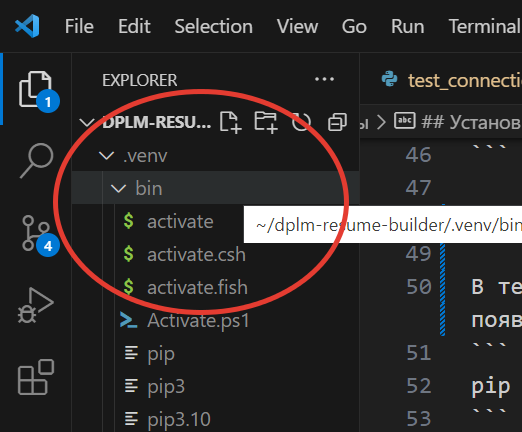
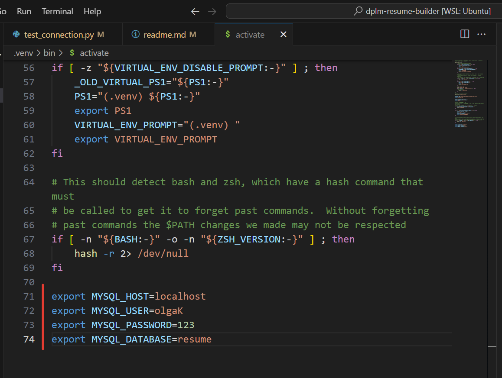
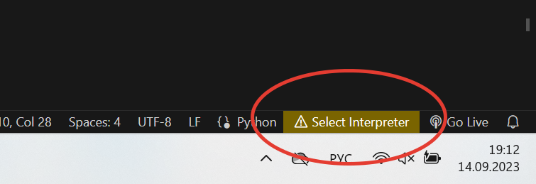
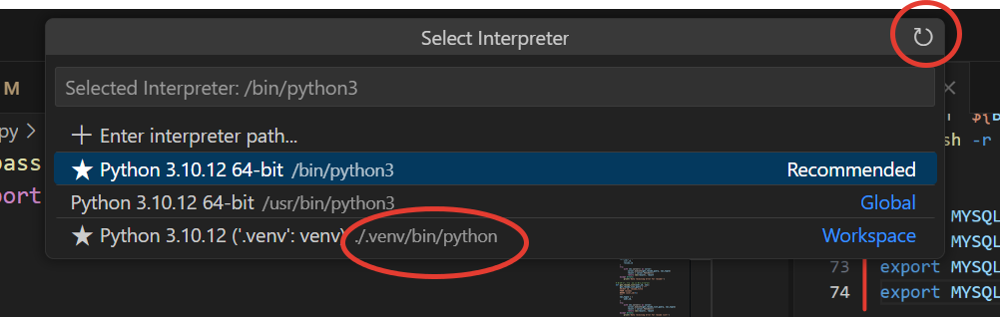
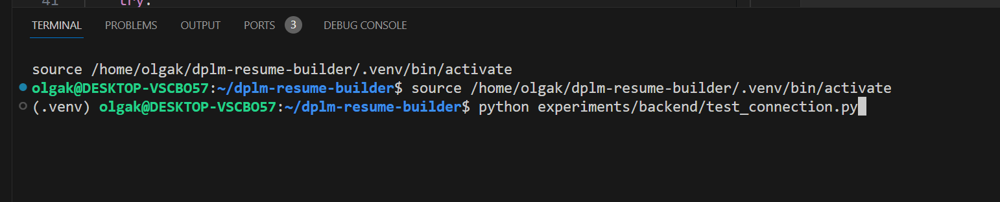
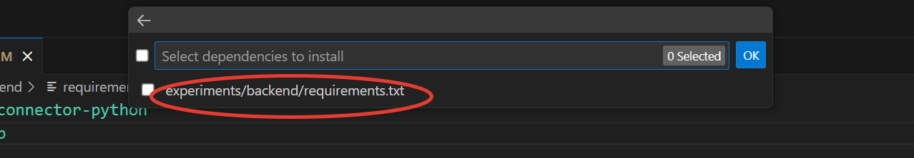
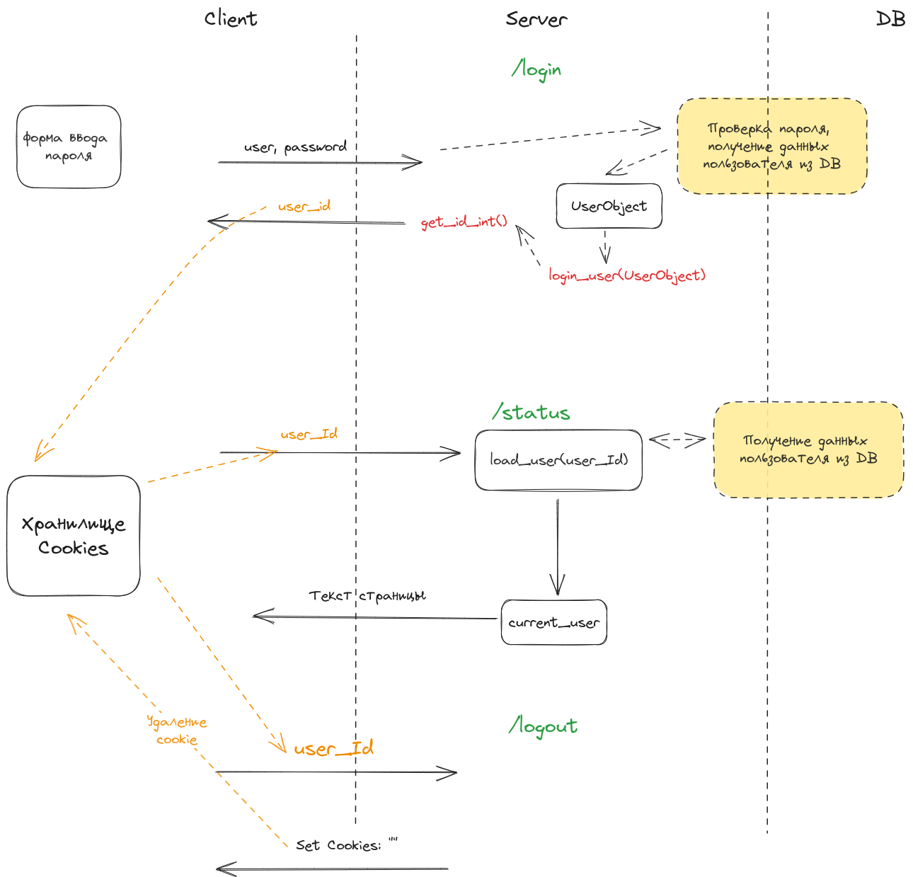

# Настройки среды
## Обновление пакетов для WSL
```
sudo apt update
sudo apt upgrade
python3 --version
>> Python 3.10.12
```

## Установка расширения для VSCode
Python Microsoft

## Установка PIP
PIP (Python Package Index) - это менеджер пакетов Python, который позволяет устанавливать, обновлять и удалять пакеты Python. PIP используется для установки пакетов из репозиториев пакетов.

```
sudo apt install python3-pip
```

## Установка и настройка виртуального окружения .venv
 
[Инструкция](https://learn.microsoft.com/ru-ru/windows/python/web-frameworks)

**Venv (Virtual Environment)** - это виртуальное окружение, которое создается для изоляции среды разработки от других проектов и зависимостей. Оно позволяет создавать отдельные среды для каждого проекта и устанавливать только нужные пакеты и зависимости.

### Настройка виртуального окружения через VSCode
1. В корневой (!!!) папке проекта (в нашем случае в папке **~/dplm-resume-builder**) выполняем следующие команды:

Установка venv:
```
sudo apt install python3-venv
```

Cоздать виртуальную среду с именем .venv (в корневой папке появится папка .venv):
```
python3 -m venv .venv
```

Активировать виртуальную среду. При срабатывании перед командной строкой появится (.venv):
```
source .venv/bin/activate
```
Отключение виртуальной среды:
```
deactivate
```

2. Установить MySQL Connector

В текущей виртуальной среде (убедиться, что перед командной строкой появилось (.venv)) выполнить команду:
```
pip install mysql-connector-python
```


3. Экспортировать данные для входа (адрес, user, пароль) из переменных окружения

В папке .venv/bin/ находим файл activate:


В файл activate добавляем экспорт переменных среды:
```
export MYSQL_HOST=localhost
export MYSQL_USER=olgaK
export MYSQL_PASSWORD=123
export MYSQL_DATABASE=resume
```


Команда export экспортирует переменную в окружающую среду оболочки так, чтобы ее значение стало доступным для MySQL и других процессов.

В Python чтение переменных окружения осуществляется через os.environ object: [ссылка на документацию.](https://www.geeksforgeeks.org/python-os-environ-object/)

В отличие от прямого доступа к объекту, функция os.getenv не вызовет ошибки если нет переменной, а возьмет значение по умолчанию (если значение по умолчанию не указано, то None). [Подробнее...](https://docs.python.org/3/library/os.html#os.getenv)

### Запуск программы

Py-файл на выполнение можно запустить двумя способами: 
1. Выбрать интерпретатор для py-файлов для запуска через VSCode

* переключиться на py-файл
* в VSCode внизу справа выбрать Select Interpreter


* выбрать интерпретатор



Теперь, при нажатии на кнопку Play в py-файле активация виртуального окружения с нужными переменными и установленным MySQL Connector будет происходить автоматически.

2. Запустить из командной строки

* активировать виртуальное окружение:
```
source .venv/bin/activate
```

* в командной строке:
```
python experiments/backend/test_connection.py
```


### Настройка виртуального окружения через Command Palette VSCode

Для проведения эксперимента нужно удалить текущее виртуальное окружение(папку .venv) и иметь файл requirements.txt с нужными зависимостями.

Ctrl + Shift + P (меню View -> Command Palette) -> Create Environment.
Предложит выбрать файл зависимостей:


Будет создано новое виртуальное окружение и интерпретатор для py-файлов подключится автоматически.

## Ошибки

DatabaseError - Can't connect to MySQL server
IntegrityError - Duplicate entry 


## Запрос на добавление пользователя

Особенностью формирования запросов к БД является то, что нельзя добавлять значения запроса, предоставленные пользователем, напрямую в строку запроса, это влечёт неучтойчивость к SQL-инъекции. Лучше отправлять значения запроса в качестве аргументов в .execute().

Неверно:
```
        user_login = input("Enter user login: ")
        user_pwd = getpass("Enter user password: ")
        insert_user_query = """
        INSERT users
        VALUES
            (DEFAULT, "%s", "%s")
        """ % (
            user_login,
            user_pwd,
        )
        with connection.cursor() as cursor:
            cursor.execute(insert_user_query)
            connection.commit()
```

Самый простой способ:
```
        user_login = input("Enter user login: ")
        user_pwd = getpass("Enter user password: ")
        insert_user_query = """
        INSERT users
        VALUES
            (DEFAULT, %s, %s)
        """ 
        val_tuple = (
            user_login,
            user_pwd,
        )
        with connection.cursor() as cursor:
            cursor.execute(insert_user_query, val_tuple)
            connection.commit()
```

[Про SQL-инъекции](https://realpython.com/prevent-python-sql-injection/)

После того, как пользователь добавлен, необходимо получить его ID. В нашем случае это можно сделать не через прямой запрос, а через объект cursor:
```
cursor.lastrowid
``` 

Также в объекте cursor есть поле rowcount - сколько строк добавлено/найдено/изменено.

## Файл requirements.txt

requirements.txt - это простой текстовый файл, который содержит перечень всех модулей и пакетов, необходимых для работы программы. 

Для того чтобы установить пакеты из requirements.txt, необходимо выполнить следующую команду:
```
pip install -r requirements.txt
```

## Хэширование паролей

Хэширование паролей - это процесс, при котором пароль преобразуется в уникальный набор символов, называемый хэшем. Этот хэш затем сохраняется на сервере вместо самого пароля.

Когда пользователь вводит свой пароль, он также преобразуется в хэш, который сравнивается с тем, что хранится на сервере. Если хэши совпадают, то пароль считается верным и пользователь получает доступ к системе.

Хэширование паролей используется для защиты от атак, связанных с кражей и подбором паролей. Оно также предотвращает возможность получения доступа к паролям пользователей путем просмотра их файлов на сервере.

В данном проекте для хэширования паролей будет использоваться библиотека [passlib](https://passlib.readthedocs.io/en/stable/#)

В примере видно, что, повторное хэширование одного и того же пароля дает разный результат.

## Markdown
[Документация](https://python-markdown.github.io/reference/)

Для конвертации таблиц нужно использовать расширение:
```
table_html=markdown.markdown(table_md, extensions=['markdown.extensions.tables'])
```

[Список доступных расширений](https://python-markdown.github.io/extensions/)

## Flask

Установка и начало работы, см. [документацию](https://learn.microsoft.com/ru-ru/windows/python/web-frameworks#hello-world-tutorial-for-flask)

Запуск программы (терминал - текущая папка):
```
flask --app <имя_файла> run
```

Запуск с отладкой (не надо перезапускать при внесении изменений):
```
flask --app <имя_файла> run --debug
```

## Flask-login
### Порядок работы


### Обработка запроса на route /login
```
/login
```
* Выполняется проверка данных пользователя - например, соответствие логина и пароля. 
* Если валидация прошла успешно, то создается объект UserSession(). Этот объект может хранить не только информацию об аутентификации, но и прочие данные пользователя (полное имя, фото, номер счета и т.п.).
* Вызов flask-login-функции login_user - сохраняет информацию о пользователе в сессии и устанавливает переменную user_id, которая может быть использована другими частями приложения для проверки, что пользователь вошел в систему.

Как выглядит вызов в httpie (в нашем примере user_id = 123):
```
http -v GET http://127.0.0.1:5000/login
GET /login HTTP/1.1
Accept: */*
Accept-Encoding: gzip, deflate
Connection: keep-alive
Host: 127.0.0.1:5000
User-Agent: HTTPie/2.6.0


HTTP/1.1 200 OK
Connection: close
Content-Length: 5
Content-Type: text/html; charset=utf-8
Date: Fri, 22 Sep 2023 10:32:50 GMT
Server: Werkzeug/2.3.7 Python/3.10.12
Set-Cookie: remember_token=123|e127d24b73464933c6fc7259a2468798b859ed25b556214e11b22025ca22e5747ffefa35e8e3d6dd47a4fc5f0c33d4b82e9df0bb16bc380ff60aa4a2501f1944; Expires=Sat, 21 Sep 2024 10:32:50 GMT; HttpOnly; Path=/
Set-Cookie: session=.eJwlzjEOwzAIQNG7MHfAYAc7l4kAg9rVaaaqd2-kjv9P7wNHrjifsL_XFQ84XhN24I46MrbO5FxCSjHuLFZrtjtjpvqkYBTXwIpkG7nTvUdnb9WzTS8cShaiI8iEMYaFVcU0E5-spBoDTau1xoRSh_eSlkoIN-Q6Y_01hRi-P5WzMXo.ZQ1tUg.RyHUP2edHTA4G6IR8b7R1uEthxc; HttpOnly; Path=/
Vary: Cookie

Login
```
Видно, что поле **Set-Cookie** содержит user_id, подписанный уникальной цифровой подписью. 

**Цифровая подпись в cookie** - это строка данных, которая добавляется к cookie для подтверждения его подлинности и целостности. Она создается с использованием ключа шифрования и содержимого cookie, и проверяется на сервере при получении cookie.

Ключ шифрования - задается один раз в приложении в переменной app.secret_key или считывается из переменных окружения:
```
app.secret_key = os.getenv('API_KEY', 'dev key')

```

НО. Для того, чтобы cookie-файл БЫЛ СОХРАНЁН НА СТОРОНЕ КЛИЕНТА, запрос должен быть отправлен с опцией --session.
* запрос без опции session: cookies формируется, но НЕ СОХРАНЯЕТСЯ на стороне клиента
* запрос с опцией --session: на стороне клиента будет создан файл, хранящий информацию о сессии и cookies.


Например, если после запроса /login без опции --session отправить запрос на /status, то в ответ придёт ответ, что пользователь не авторизован. Это произошло потому, что информация о cookies сохраняется в файле сессии (см. пп. Где хранятся cookie-файлы?):
```
http -v  GET http://127.0.0.1:5000/status
GET /status HTTP/1.1
Accept: */*
Accept-Encoding: gzip, deflate
Connection: keep-alive
Host: 127.0.0.1:5000
User-Agent: HTTPie/2.6.0


HTTP/1.1 200 OK
Connection: close
Content-Length: 17
Content-Type: text/html; charset=utf-8
Date: Fri, 22 Sep 2023 10:15:32 GMT
Server: Werkzeug/2.3.7 Python/3.10.12
Vary: Cookie

not authentication
```

Теперь отправим запрос /login с флагом --session и запомним, что мы назначили сессии имя my_test_session:
```
http -v --session=my_test_session GET http://127.0.0.1:5000/status
GET /login HTTP/1.1
Accept: */*
Accept-Encoding: gzip, deflate
Connection: keep-alive
Host: 127.0.0.1:5000
User-Agent: HTTPie/2.6.0


HTTP/1.1 200 OK
<...>
Set-Cookie: remember_token=123|e127d24b73464933c6fc7259a2468798b859ed25b556214e11b22025ca22e5747ffefa35e8e3d6dd47a4fc5f0c33d4b82e9df0bb16bc380ff60aa4a2501f1944; Expires=Sat, 21 Sep 2024 10:27:24 GMT; HttpOnly; Path=/
Set-Cookie: session=.eJwlzjEOwzAIQNG7MHfAYAc7l4kAg9rVaaaqd2-kjv9P7wNHrjifsL_XFQ84XhN24I46MrbO5FxCSjHuLFZrtjtjpvqkYBTXwIpkG7nTvUdnb9WzTS8cShaiI8iEMYaFVcU0E5-spBoDTau1xoRSh_eSlkoIN-Q6Y_01hRi-P5WzMXo.ZQ1sDA.pfvceWrF4ndFuhi7ULGRe518y2w; HttpOnly; Path=/
Vary: Cookie

Login
```

Отправим запрос /status с флагом --session - видно, что информация о cookie ушла в запросе и был получен ответ, что пользователь авторизован:
```
http -v --session=my_test_session GET http://127.0.0.1:5000/status
GET /status HTTP/1.1
Accept: */*
Accept-Encoding: gzip, deflate
Connection: keep-alive
Cookie: remember_token=123|e127d24b73464933c6fc7259a2468798b859ed25b556214e11b22025ca22e5747ffefa35e8e3d6dd47a4fc5f0c33d4b82e9df0bb16bc380ff60aa4a2501f1944; session=.eJwlzjEOwzAIQNG7MHfAYAc7l4kAg9rVaaaqd2-kjv9P7wNHrjifsL_XFQ84XhN24I46MrbO5FxCSjHuLFZrtjtjpvqkYBTXwIpkG7nTvUdnb9WzTS8cShaiI8iEMYaFVcU0E5-spBoDTau1xoRSh_eSlkoIN-Q6Y_01hRi-P5WzMXo.ZQ1riA.CQN4SSypDaKnhaXHoaCvEKGqDyo
Host: 127.0.0.1:5000
User-Agent: HTTPie/2.6.0


HTTP/1.1 200 OK
Connection: close
Content-Length: 25
Content-Type: text/html; charset=utf-8
Date: Fri, 22 Sep 2023 10:29:19 GMT
Server: Werkzeug/2.3.7 Python/3.10.12
Vary: Cookie

authenticated user_id=123
```

Если отправить тот же запрос, но без опции --session, то получим ответ, что пользователь не авторизован:
```
 http -v  GET http://127.0.0.1:5000/status
GET /status HTTP/1.1
Accept: */*
Accept-Encoding: gzip, deflate
Connection: keep-alive
Host: 127.0.0.1:5000
User-Agent: HTTPie/2.6.0


HTTP/1.1 200 OK
<...>
Vary: Cookie

not authenticated
```


### Где хранится информация о сессиях и cookies?
Cookie-файлы НИКОГДА не хранятся на сервере. Httpie хранит информацию о сессиях и cookie в каталоге ~/.config/httpie/sessions/127.0.0.1_5000/. Список сохраненных сессий можно посмотреть командой:
```
ls -l ~/.config/httpie/sessions/127.0.0.1_5000/
total 4
-rw-r--r-- 1 olgak olgak 915 Sep 22 13:25 my_test_session.json
```

Если просмотреть этот файл командой:
```
cat ~/.config/httpie/sessions/127.0.0.1_5000/ my_test_session.json
```
то увидим, что информация о cookies сохранена в поле "cookies".

Если сделать запрос на /status и указать имя сессии, с которым не был сделан login, то получим ответ:
```
http -v --session=my_test_session2 GET http://127.0.0.1:5000/status
GET /status HTTP/1.1
Accept: */*
Accept-Encoding: gzip, deflate
Connection: keep-alive
Host: 127.0.0.1:5000
User-Agent: HTTPie/2.6.0


HTTP/1.1 200 OK
<...>
Vary: Cookie

not authenticated
```
При этом, в списке файлов сохраненных сессий httppie появится файл my_test_session_2:
```
ls -l ~/.config/httpie/sessions/127.0.0.1_5000/
total 8
-rw-r--r-- 1 olgak olgak 915 Sep 22 13:33 my_test_session.json
-rw-r--r-- 1 olgak olgak 277 Sep 22 13:33 my_test_session2.json
```

Если просмотреть файл my_test_session2.json, то увидим, что поле "cookies" пустое:
```
cat  ~/.config/httpie/sessions/127.0.0.1_5000/my_test_session2.json
{
    "__meta__": {
        "about": "HTTPie session file",
        "help": "https://httpie.io/docs#sessions",
        "httpie": "2.6.0"
    },
    "auth": {
        "password": null,
        "type": null,
        "username": null
    },
    "cookies": {}, // поле пустое!
    "headers": {}
}
```

Таким образом, httpie хранит информацию обо всех сессиях (запросах, которые были выполнены с флагом --session), но при этом в сессии МОЖЕТ НЕ БЫТЬ cookies.

```
request.form.get - если данные в формате form data
request.json.get - если данные json (из react или vue)
```

### Обработка запроса на route /status
```
/status
```
* flask-login после проверки cookies (есть такая сессия или нет) создаст переменную current_user
* затем будет создан и заполнен объект UserSession и выполнена проверка is_authenticated - авторизован пользователь или нет
> Объект UserSession содержит не только те свойства и методы, которые реализованы в примере. Этот объект наследуется от UserMixin, таким образом, мы получаем доступ к различным методам и атрибутам, которые связаны с аутентификацией и авторизацией пользователя. Например, можно получить доступ к методам is_authenticated() и is_active(), которые проверяют, аутентифицирован ли пользователь и активен ли его аккаунт.

### Обработка запроса на route /logout
```
/logout
```
Будет вызвана функция logout_user. Эта функция используется для выхода текущего пользователя из системы. Она очищает информацию о пользователе из сессии.
```
http -v --session=my_test_session GET http://127.0.0.1:5000/logout
GET /logout HTTP/1.1
Accept: */*
Accept-Encoding: gzip, deflate
Connection: keep-alive
Cookie: remember_token=123|e127d24b73464933c6fc7259a2468798b859ed25b556214e11b22025ca22e5747ffefa35e8e3d6dd47a4fc5f0c33d4b82e9df0bb16bc380ff60aa4a2501f1944; session=.eJwlzjEOwzAIQNG7MHfAYAc7l4kAg9rVaaaqd2-kjv9P7wNHrjifsL_XFQ84XhN24I46MrbO5FxCSjHuLFZrtjtjpvqkYBTXwIpkG7nTvUdnb9WzTS8cShaiI8iEMYaFVcU0E5-spBoDTau1xoRSh_eSlkoIN-Q6Y_01hRi-P5WzMXo.ZQ1riA.CQN4SSypDaKnhaXHoaCvEKGqDyo
Host: 127.0.0.1:5000
User-Agent: HTTPie/2.6.0


HTTP/1.1 200 OK
<...>
Set-Cookie: remember_token=; Expires=Thu, 01 Jan 1970 00:00:00 GMT; Max-Age=0; Path=/
Set-Cookie: session=; Expires=Thu, 01 Jan 1970 00:00:00 GMT; Max-Age=0; HttpOnly; Path=/
Vary: Cookie

Logout
```
Поля Set-Cookie вернулись ПУСТЫМИ. Если просмотреть файл сессии my_test_session:
```
cat  ~/.config/httpie/sessions/127.0.0.1_5000/my_test_session.json
```
то увидим, что информация о cookies удалена:
```
{
    "__meta__": {
        "about": "HTTPie session file",
        "help": "https://httpie.io/docs#sessions",
        "httpie": "2.6.0"
    },
    "auth": {
        "password": null,
        "type": null,
        "username": null
    },
    "cookies": {},
    "headers": {}
}
```

### Stateless-запросы

Подход, при котором информация не хранится на сервере, а передается или в самих запросах, или хранится у пользователя, называется stateless запросами.

Stateless запросы - это запросы, которые не хранят информацию о состоянии между запросами. Это означает, что каждый запрос должен быть полностью независимым, обрбатываться как новый и не использовать информацию из предыдущих запросов.

В нашем случае:
* объект UserSession будет создан заново при каждом запросе
* информация о cookies шифруется секретным ключом и хранится на стороне пользователя


## Команды httpie для выполнения запросов

Для вывода подробной информации о запросе и ответе используется флаг -v. 

route /
```
http  GET http://127.0.0.1:5000/
```

route /json
```
http  GET http://127.0.0.1:5000/json
```

route /req
```
http GET http://127.0.0.1:5000/req
http POST http://127.0.0.1:5000/req
```

route /url
```
http GET  http://127.0.0.1:5000/url?string
http GET  http://127.0.0.1:5000/url/123
```

route /login
```
http -v --session=my_test_session POST http://127.0.0.1:5000/login user=username password=secret

http -v --session=my_test_session GET http://127.0.0.1:5000/login
```

route /status
```
http -v --session=my_test_session GET http://127.0.0.1:5000/status
```

route /logout
```
http -v --session=my_test_session GET http://127.0.0.1:5000/logout
```

### XSS (Cross-site scripting) 
XSS (Cross-site scripting) - это тип уязвимости безопасности, который позволяет внедрять вредоносный код в веб-сайты. Этот код может быть использован для кражи личных данных пользователей, изменения интерфейса сайта или других вредоносных действий. 

Для предотвращения XSS необходимо фильтровать входные данные от пользователей перед их использованием на сайте.

В случае данного проекте существуют два уязвимых места:
1. SQL-инъекция. Для предотвращения используем особый способ передачи данных - не напрямую в строку запроса, а в качестве аргументов в функцию execute() Mysql Connector Python.

2. XSS-атаки через HTML-шаблоны. Для предотвращения используем функцию escape() в jinja. Она заменяет опасные символы на безопасные аналоги, чтобы предотвратить выполнение вредоносного кода. Во flask при выполнении функции render_template параметр autoescape=True включен автоматически.