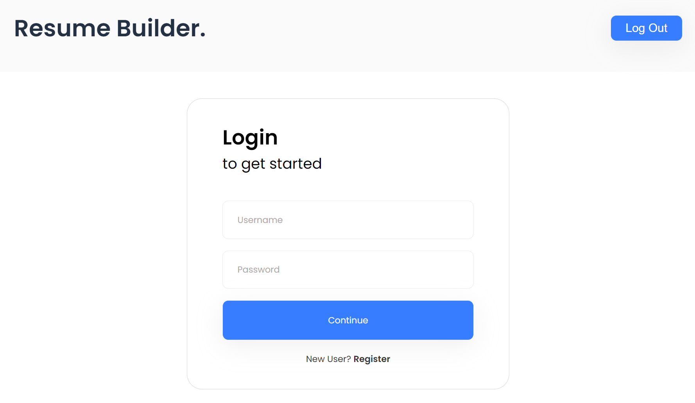
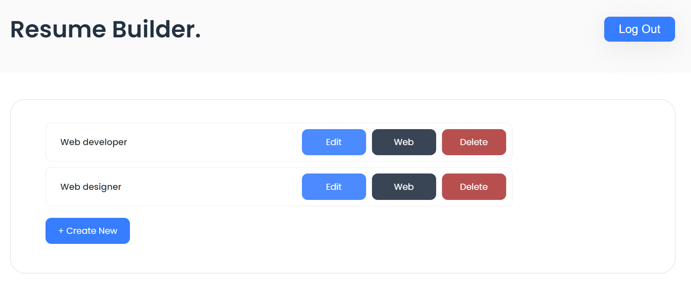

# Diplome Resume Builder

## Запуск готового проекта
1. Создать в корневой папке проекта файл .env с содержимым:
```
MYSQL_HOST=db
MYSQL_ROOT_PASSWORD=123
MYSQL_DATABASE=resume
MYSQL_USER=olgaK
MYSQL_PASSWORD=123

SECRET_KEY=secret key
```


2. Запуск готового проекта
```
docker compose up -d
```

3. Зайти на адрес: http://localhost/

4. Скриншоты

Страница регистрации:



Список резюме:


